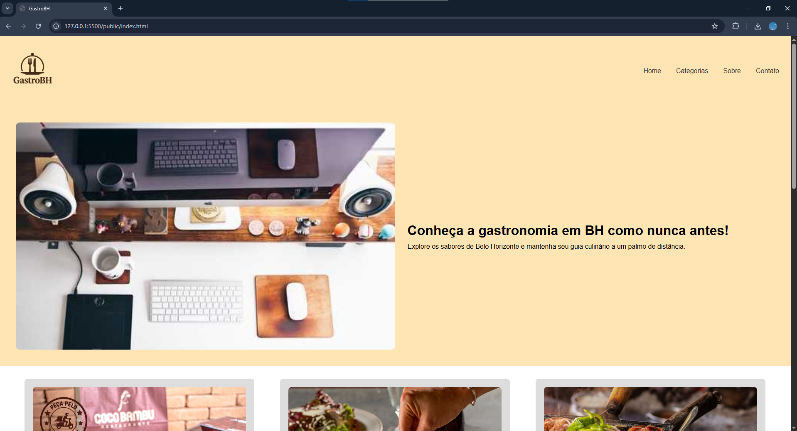
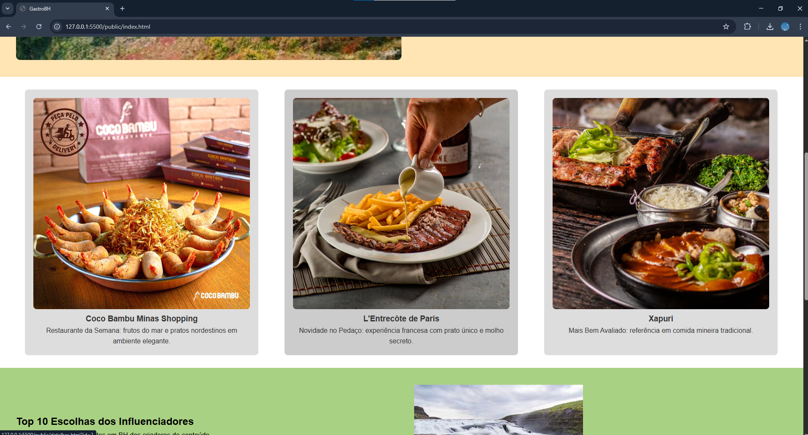
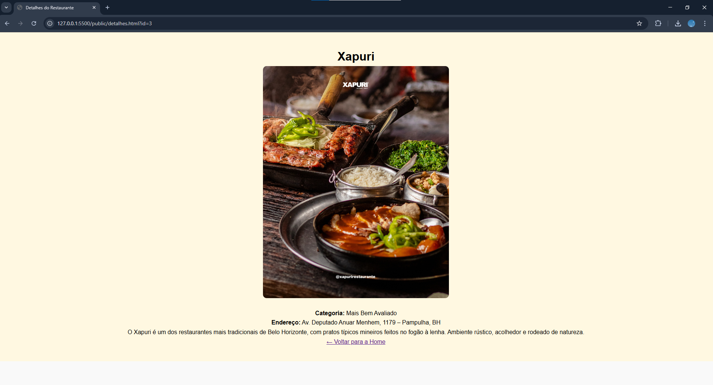

# Trabalho Prático 05 - Semanas 7 e 8

**Páginas de detalhes dinâmicas**

Nessa etapa, vamos evoluir o trabalho anterior, acrescentando a página de detalhes, conforme o  projeto escolhido. Imagine que a página principal (home-page) mostre um visão dos vários itens que existem no seu site. Ao clicar em um item, você é direcionado pra a página de detalhes. A página de detalhe vai mostrar todas as informações sobre o item do seu projeto. seja esse item uma notícia, filme, receita, lugar turístico ou evento.

Leia o enunciado completo no Canvas.

**IMPORTANTE:** Assim como informado anteriormente, capriche na etapa pois você vai precisar dessa parte para as próximas semanas.

**IMPORTANTE:** Você deve trabalhar e alterar apenas arquivos dentro da pasta **`public`,** mantendo os arquivos **`index.html`**, **`styles.css`** e **`app.js`** com estes nomes, conforme enunciado. Deixe todos os demais arquivos e pastas desse repositório inalterados. **PRESTE MUITA ATENÇÃO NISSO.**

## Informações Gerais

- Nome: Bruna Pedrosa Nunes
- Matricula: 901902
- Proposta de projeto escolhida: GastroBH
- Breve descrição sobre seu projeto: O projeto se trata de um site que visa auxiliar o público de BH a encontrar locais para viver toda a experiência gastronômica que existe na cidade e que muitas pessoas ainda não conhecem.

## Print da Home-Page




## Print da página de detalhes do item



## Cole aqui abaixo a estrutura JSON utilizada no app.js

```javascript
const locais = [
  {
    id: 1,
    nome: "Coco Bambu Minas Shopping",
    descricao:
      "Restaurante da Semana: frutos do mar e pratos nordestinos em ambiente elegante.",
    imagem: "../img/coco_bambu.jpg",
    categoria: "Restaurante da Semana",
    endereco: "Av. Cristiano Machado, 4000 – União, BH",
    detalhes:
      "O Coco Bambu é conhecido pela variedade de pratos com frutos do mar, porções generosas e ambiente refinado. Ideal para encontros em família ou comemorações especiais.",
  },
  {
    id: 2,
    nome: "L'Entrecôte de Paris",
    descricao:
      "Novidade no Pedaço: experiência francesa com prato único e molho secreto.",
    imagem: "../img/lentrecote.jpg",
    categoria: "Novidade no Pedaço",
    endereco: "Rua Marília de Dirceu, 226 – Lourdes, BH",
    detalhes:
      "O L'Entrecôte de Paris oferece uma experiência gastronômica francesa com foco em um prato principal: entrecôte com batatas fritas e molho exclusivo. Sofisticação e simplicidade em um só lugar.",
  },
  {
    id: 3,
    nome: "Xapuri",
    descricao: "Mais Bem Avaliado: referência em comida mineira tradicional.",
    imagem: "../img/xapuri.jpg",
    categoria: "Mais Bem Avaliado",
    endereco: "Av. Deputado Anuar Menhem, 1179 – Pampulha, BH",
    detalhes:
      "O Xapuri é um dos restaurantes mais tradicionais de Belo Horizonte, com pratos típicos mineiros feitos no fogão à lenha. Ambiente rústico, acolhedor e rodeado de natureza.",
  },
];
```
